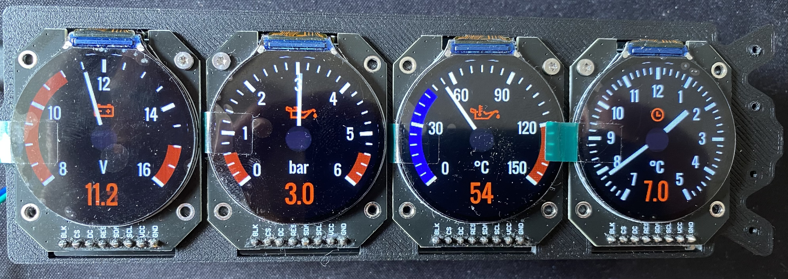
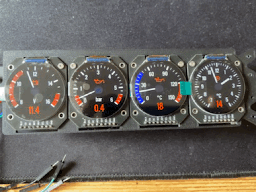
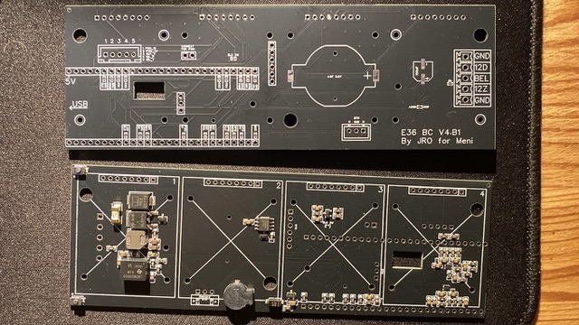

| Supported Targets | ESP32-P4 | ESP32-S3 |
| ----------------- | -------- | -------- |

# Customizable ESP32 Boardcomputer

This project implements a custom-built boardcomputer for classic vehicles like the BMW E36. Instead of the standard BMW boardcomputer (which only displays average fuel consumption or broken light bulbs), or multifunctional clocks (date, time, temperature), this system provides a complete display of current engine parameters.

**Main Features:**
- Display of oil temperature, oil pressure, battery voltage, and time/temperature
- Four round TFT displays for separate gauges
- Adjustable number and type of displays
- Fully customizable design via LVGL

The E36 version uses four displays, each with its own gauge. All parameters are configurable.





## Hardware Overview

The project is based on a powerful ESP32-P4 that controls all peripherals.

**Components used for the E36 boardcomputer:**
- **ESP32-P4 WT9932P4-TINY** - Main processor
- **4x 1.28 Inch Round TFT LCD Display (240x240 RGB) with GC9A01 Driver** ([Link to AliExpress](https://de.aliexpress.com/item/1005009364283361.html))
- **Custom PCB** to connect the displays and peripherals with the ESP (in the `hardware/` directory)



- **5V Buzzer** for warnings when outside temperature is below 3°C
- **2x Buttons** for time adjustment
- **12V to 5V Converter** for power supply
- **BMW Oil Temperature and Pressure Sensor (Hella 6PP 010 378-201)** - PWM signal from engine
- or using analog **VDO sensors** for oil pressure and temperature

The datasheets for the used components can be found in the `datasheets/` directory.

## Software

- **FreeRTOS Tasks** for scheduling different operations
- **LVGL** for designing the gauges
- **ADC Sampling** of sensor values oder alternativ **PWM Sampling** of oil pressure und oil temperature based on VDO sensor characteristics; PWM sampling is based on Hella Sensor 6PP 010 378-201
- **Modular Architecture** mit separate directories für calculation, logging, LVGL-UI, und peripherals

## Test mode activation

In test mode, sensor-critical values are simulated and the UI loop runs in a deterministic cycle.
Activate test mode with the following button sequence within `TESTMODE_ACTIVATE_TIMEOUT_MS` (7 seconds):

1. Press minute button twice to decrease minute
2. Press hour button once to decrease hour
3. Press minute button twice to increase minute
4. Press hour button once to increase hour and toggle test mode

On success, logs show:
- `"Test mode ACTIVATED!"` or `"Test mode DEACTIVATED!"`

Activation parameters are defined in `main/individual_config.h`:
- `TESTMODE_ACTIVATE_TIMEOUT_MS` (=10000 ms)
- `TESTMODE_ACTIVATE_BUTTON_1_COUNT` (=2)
- `TESTMODE_ACTIVATE_BUTTON_2_COUNT` (=1)
- `TESTMODE_ACTIVATE_BUTTON_3_COUNT` (=2)
- `TESTMODE_ACTIVATE_BUTTON_4_COUNT` (=1)

## How to Flash the Project

1. **Requirements:**
   - ESP-IDF installed (version according to SDK configuration)
   - USB cable for the ESP32-P4

2. **Compile the project:**
   ```
   idf.py build
   ```

3. **Flash:**
   ```
   idf.py flash
   ```

4. **Start monitor:**
   ```
   idf.py monitor
   ```

For detailed instructions see the official ESP-IDF guides.

## Project Structure

```
├── CMakeLists.txt              # Main build configuration
├── sdkconfig                   # ESP-IDF configuration
├── main/                       # Main source code
│   ├── CMakeLists.txt
│   ├── main.c                  # Main entry point
│   ├── individual_config.h     # Configuration defines
│   ├── calculation/            # Calculation modules
│   ├── logging/                # Logging functions
│   ├── lvgl/                   # LVGL-UI and graphics
│   └── peripherie/             # Peripheral drivers (buzzer, buttons, etc.)
├── demo/                       # Demo images and videos
├── hardware/                   # PCB design and hardware files
├── datasheets/                 # Datasheets of components
├── fonts/                      # Fonts
├── png/                        # Images and icons
├── build/                      # Build artifacts (generated)
├── html/                       # Doxygen HTML documentation
├── latex/                      # Doxygen LaTeX documentation
├── managed_components/         # ESP-IDF components
└── README.md                   # This file
```

## Roadmap / ToDo

### Hardware

- **ADC performance optimization**
  - Current external ADCs are too slow for time-critical measurements  
  - Evaluate switching to internal ADCs of the ESP32  
  - Verify compatibility across different ESP32 variants  
  - Consider hybrid approach: keep one external ADC for non-time-critical signals

- **Reference voltage measurement**
  - Add hardware support to measure reference voltage  
  - Implement software compensation for improved ADC accuracy

- **PCB redesign**
  - Rework pin mapping, especially with respect to ADC usage  
  - Optimize signal routing and noise immunity (automotive environment)

- **Add acceleration sensor**
  - Integrate accelerometer (e.g. for G-force measurement)  
  - Evaluate placement and filtering requirements

- **New enclosure (case)**
  - Design and manufacture an improved housing  
  - Consider thermal behavior, vibration resistance, and mounting

### Firmware / Software

- **Improve ADC sampling**
  - Reduce latency and jitter  
  - Evaluate DMA / continuous sampling if supported  
  - Implement filtering (moving average, median, etc.)

- **Display responsiveness**
  - Optimize LVGL rendering performance  
  - Reduce UI lag and improve refresh behavior

- **Test mode rework**
  - Current implementation is no longer reliable  
  - Redesign test mode to better integrate with normal operation  
  - Ensure deterministic behavior and easier activation/debugging

- **Sensor abstraction layer**
  - Improve modularity for different sensor types (PWM vs analog)  
  - Allow easier configuration or runtime switching

- **Error handling & diagnostics**
  - Add better logging for sensor faults and communication errors  
  - Implement fallback strategies for invalid readings

### System / Features / UX

- **New display concepts**
  - Evaluate alternative visualization types (e.g. G-force display, combined gauges)  
  - Improve readability and usability while driving

- **Startup & calibration behavior**
  - Ensure stable readings after power-on (temperature drift, warm-up effects)  
  - Add optional calibration phase or adaptive filtering

- **Performance monitoring**
  - Track system load (CPU, memory, task timing)  
  - Identify bottlenecks in real-world usage

- **Configuration improvements**
  - Make system configuration more flexible (compile-time vs runtime)  
  - Possibly introduce a simple settings interface


## Troubleshooting

* **Flashing errors:**
  - Check the USB connection: run `idf.py -p PORT monitor` and restart the board to see logs.
  - Baud rate too high: reduce the baud rate in `menuconfig` and try again.

* **Display problems:**
  - Check SPI pins in `individual_config.h`
  - Ensure power supply (12V to 5V converter)

